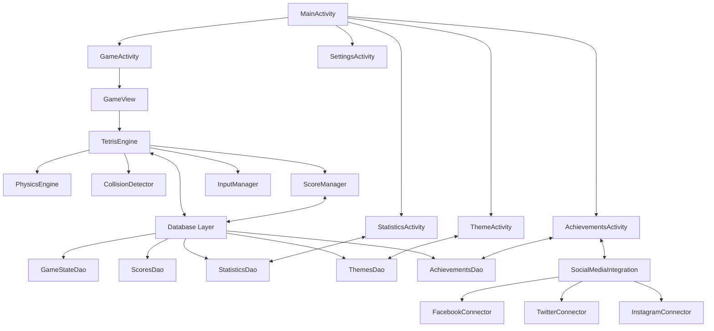
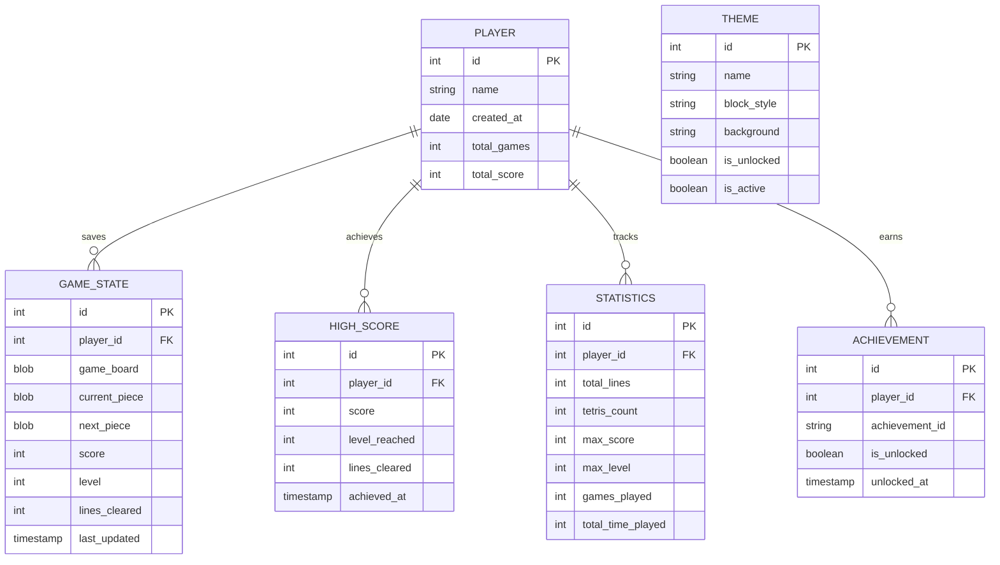
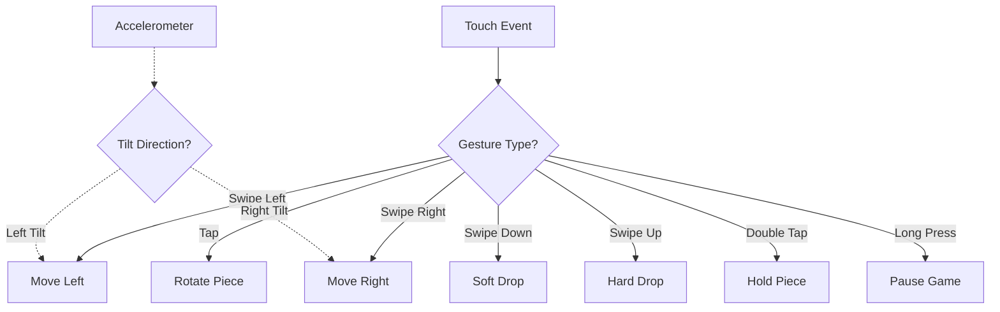
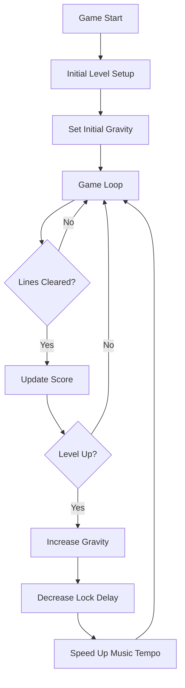
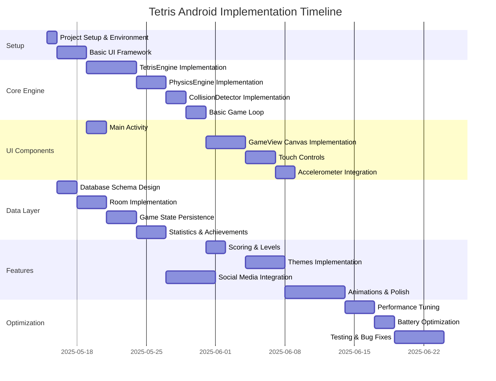

# Android Tetris Game - Architectural Design Plan

## 1. Application Overview

Our Tetris game will be a modern, feature-rich mobile implementation for Android 8.0+ devices using Kotlin and Canvas-based rendering. The game will include intuitive touch controls, smooth animations, customizable themes, and advanced features like game state persistence and social sharing.

## 2. System Architecture

The architecture follows a modular approach with clear separation of concerns between UI, game logic, data management, and social integration:



## 3. Core Components in Detail

### 3.1 UI Layer

#### MainActivity
- Entry point of the application
- Menu navigation to all screens
- Modern Material Design UI
- Options for new game, continue, settings, themes, statistics, achievements

#### GameActivity
- Hosts the actual Tetris game
- Manages game lifecycle
- Handles pause/resume functionality
- Displays current score, level, and next piece

#### GameView (Canvas-based rendering)
- Custom view for rendering the game
- Double-buffered drawing for smooth animations
- Touch event handling
- Frame rate management for consistent performance

### 3.2 Game Logic Layer

#### TetrisEngine
- Core game logic implementation
- Game loop management
- Game state management (active, paused, game over)
- Piece generation and management
- Integration with collision detection and physics

#### PhysicsEngine
- Handles piece movement calculations
- Gravity simulation with progressive difficulty
- "Lock delay" implementation for piece placement
- Fast-drop mechanics

#### CollisionDetector
- Border collision detection
- Piece-to-piece collision detection
- Line completion detection
- Game over condition detection

#### ScoreManager
- Point calculation based on actions (line clears, etc.)
- Level progression logic
- Combo system for consecutive line clears
- Achievement triggering

#### InputManager
- Touch gesture recognition (swipe, tap)
- Optional accelerometer integration
- Input debouncing and validation
- Custom control sensitivity settings

### 3.3 Data Layer

#### Database Structure (Room/SQLite)
- Game state persistence for interrupted games
- High scores with player identifiers
- Game statistics (games played, lines cleared, max level, etc.)
- Theme preferences and unlocked themes
- Achievements tracking



### 3.4 Social Integration

#### SocialMediaManager
- Unified API for social sharing
- Screenshot capturing for sharing
- Score formatting for different platforms
- Achievement sharing

#### Platform Connectors
- Facebook integration
- Twitter integration
- Instagram integration
- Share content customization

## 4. Key Features Implementation

### 4.1 Touch Controls



### 4.2 Adaptive Difficulty System



### 4.3 Customizable Themes

- Modern default theme
- Classic retro theme
- Minimalist theme
- High-contrast accessibility theme
- Custom themes with color picker
- Theme unlock system based on achievements

### 4.4 Battery Optimization

- Frame rate throttling when battery is low
- Reduced animations option
- Background processing optimization
- Efficient rendering with dirty rectangle tracking
- Screen refresh rate adaptation

## 5. Implementation Map

### 5.1 Project Structure

```
app/
├── src/
│   ├── main/
│   │   ├── java/com/tetris/
│   │   │   ├── activities/
│   │   │   │   ├── MainActivity.kt
│   │   │   │   ├── GameActivity.kt
│   │   │   │   ├── SettingsActivity.kt
│   │   │   │   ├── StatisticsActivity.kt
│   │   │   │   └── ThemeActivity.kt
│   │   │   ├── game/
│   │   │   │   ├── GameView.kt
│   │   │   │   ├── TetrisEngine.kt
│   │   │   │   ├── PhysicsEngine.kt
│   │   │   │   ├── CollisionDetector.kt
│   │   │   │   ├── ScoreManager.kt
│   │   │   │   └── InputManager.kt
│   │   │   ├── model/
│   │   │   │   ├── Piece.kt
│   │   │   │   ├── Board.kt
│   │   │   │   ├── Player.kt
│   │   │   │   └── Statistics.kt
│   │   │   ├── data/
│   │   │   │   ├── AppDatabase.kt
│   │   │   │   ├── GameStateDao.kt
│   │   │   │   ├── ScoreDao.kt
│   │   │   │   ├── StatisticsDao.kt
│   │   │   │   ├── ThemeDao.kt
│   │   │   │   └── AchievementDao.kt
│   │   │   ├── social/
│   │   │   │   ├── SocialMediaManager.kt
│   │   │   │   ├── FacebookConnector.kt
│   │   │   │   ├── TwitterConnector.kt
│   │   │   │   └── InstagramConnector.kt
│   │   │   ├── utils/
│   │   │   │   ├── Constants.kt
│   │   │   │   ├── BatteryOptimizer.kt
│   │   │   │   └── ThemeManager.kt
│   │   │   └── services/
│   │   │       ├── AudioService.kt
│   │   │       └── AchievementService.kt
│   │   ├── res/
│   │   │   ├── layout/
│   │   │   │   ├── activity_main.xml
│   │   │   │   ├── activity_game.xml
│   │   │   │   ├── activity_settings.xml
│   │   │   │   └── ...
│   │   │   ├── drawable/
│   │   │   │   ├── block_*.png
│   │   │   │   ├── background_*.png
│   │   │   │   └── ...
│   │   │   ├── values/
│   │   │   │   ├── colors.xml
│   │   │   │   ├── strings.xml
│   │   │   │   └── styles.xml
│   │   │   └── raw/
│   │   │       ├── game_music.mp3
│   │   │       ├── effect_*.wav
│   │   │       └── ...
│   │   └── AndroidManifest.xml
```

### 5.2 Implementation Timeline and Dependencies



## 6. Key Classes and Their Responsibilities

### 6.1 GameView.kt
- Custom View implementation for Canvas-based rendering
- Surface holder management and double buffering
- Main drawing routines for board, pieces, UI elements
- Frame timing and animation handling
- Touch event detection and delegation to InputManager

### 6.2 TetrisEngine.kt
- Main game loop implementation
- Game state management (play, pause, game over)
- Coordination between all other components
- Piece generation and management
- Core game mechanics implementation

### 6.3 AppDatabase.kt
- Room database configuration
- Migration strategies
- DAO instantiation
- Transaction management
- Entity relationships

### 6.4 Key Algorithms

#### Random Piece Generation (7-bag randomization)
```kotlin
class PieceGenerator {
    private val bag = mutableListOf<PieceType>()
    
    fun getNextPiece(): Piece {
        if (bag.isEmpty()) {
            refillBag()
        }
        val type = bag.removeAt(0)
        return Piece(type)
    }
    
    private fun refillBag() {
        // 7-bag randomization ensures all pieces appear with equal frequency
        bag.addAll(PieceType.values())
        bag.shuffle()
    }
}
```

#### Collision Detection
```kotlin
fun isCollision(piece: Piece, board: Board, offsetX: Int = 0, offsetY: Int = 0): Boolean {
    piece.blocks.forEach { block ->
        val x = piece.x + block.x + offsetX
        val y = piece.y + block.y + offsetY
        
        // Check bounds
        if (x < 0 || x >= board.width || y < 0 || y >= board.height) {
            return true
        }
        
        // Check if space is already occupied
        if (y >= 0 && board.cells[y][x] != null) {
            return true
        }
    }
    return false
}
```

#### Line Clearing
```kotlin
fun checkAndClearLines(board: Board): Int {
    val linesToClear = mutableListOf<Int>()
    
    // Find complete lines
    for (y in 0 until board.height) {
        var complete = true
        for (x in 0 until board.width) {
            if (board.cells[y][x] == null) {
                complete = false
                break
            }
        }
        if (complete) {
            linesToClear.add(y)
        }
    }
    
    // Clear lines and move blocks down
    linesToClear.sortedDescending().forEach { lineY ->
        // Clear the line
        for (x in 0 until board.width) {
            board.cells[lineY][x] = null
        }
        
        // Move all lines above down
        for (y in lineY downTo 1) {
            for (x in 0 until board.width) {
                board.cells[y][x] = board.cells[y-1][x]
            }
        }
        
        // Clear the top line
        for (x in 0 until board.width) {
            board.cells[0][x] = null
        }
    }
    
    return linesToClear.size
}
```

## 7. Cross-cutting Concerns

### 7.1 Performance Optimization
- Efficient rendering using dirty rectangle tracking
- Canvas hardware acceleration
- Bitmap caching for piece rendering
- ViewPort clipping optimization
- Reduced allocations in game loop
- Custom thread handling for game logic

### 7.2 Battery Optimization
- Dynamic frame rate based on battery level
- Reduced processing during inactive states
- Efficient wake lock management
- Bitmap recycling and memory management
- Adaptive rendering quality

### 7.3 Accessibility
- Customizable control sensitivity
- High-contrast theme option
- Haptic feedback for interactions
- Screen reader compatibility for menus
- Adjustable game speed settings

## 8. Testing Strategy

### 8.1 Unit Tests
- Core game logic test cases
- Tetris piece movement and rotation tests
- Collision detection edge cases
- Line clearing scenarios
- Scoring system verification

### 8.2 Integration Tests
- Database operations and migrations
- Game state persistence and recovery
- Theme application and persistence
- Social media integration tests

### 8.3 UI/UX Tests
- Touch control sensitivity and accuracy
- Frame rate consistency across devices
- UI element scaling on different screen sizes
- Animation smoothness verification

### 8.4 Performance Profiling
- Memory usage monitoring
- CPU utilization testing
- Battery consumption analysis
- Startup time optimization

## 9. Dependencies and Libraries

```kotlin
// build.gradle (app level)
dependencies {
    // Core Android
    implementation 'androidx.core:core-ktx:1.7.0'
    implementation 'androidx.appcompat:appcompat:1.4.1'
    implementation 'com.google.android.material:material:1.5.0'
    implementation 'androidx.constraintlayout:constraintlayout:2.1.3'
    
    // Room for database
    implementation 'androidx.room:room-runtime:2.4.2'
    implementation 'androidx.room:room-ktx:2.4.2'
    kapt 'androidx.room:room-compiler:2.4.2'
    
    // Lifecycle components
    implementation 'androidx.lifecycle:lifecycle-viewmodel-ktx:2.4.1'
    implementation 'androidx.lifecycle:lifecycle-livedata-ktx:2.4.1'
    
    // Coroutines for asynchronous programming
    implementation 'org.jetbrains.kotlinx:kotlinx-coroutines-android:1.6.0'
    
    // Social media SDKs
    implementation 'com.facebook.android:facebook-android-sdk:5.15.3'
    implementation 'com.twitter.sdk.android:twitter-core:3.3.0'
    
    // Image handling and sharing
    implementation 'com.github.bumptech.glide:glide:4.13.0'
    
    // Testing
    testImplementation 'junit:junit:4.13.2'
    androidTestImplementation 'androidx.test.ext:junit:1.1.3'
    androidTestImplementation 'androidx.test.espresso:espresso-core:3.4.0'
}